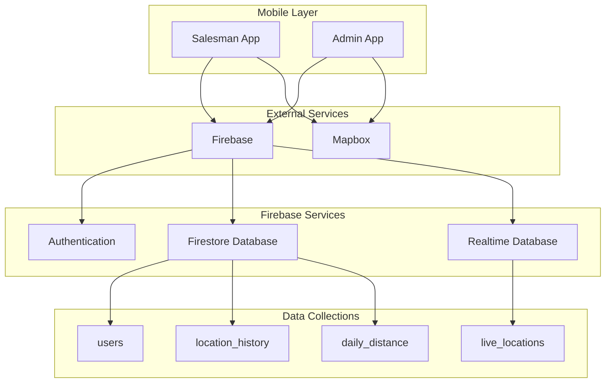

# Design Document: Live Salesman Tracking System

## Overview

The Live Salesman Tracking System is a real-time location monitoring platform built with Flutter for cross-platform mobile and web applications. The system leverages Firebase for real-time data synchronization and user authentication, and Mapbox for advanced mapping capabilities. The architecture follows a three-phase implementation approach, with Phase 1 focusing on foundational setup of external services and basic infrastructure.

The system supports two primary user roles: Administrators who monitor and manage field operations, and Salesmen who use mobile devices for field work while being tracked. Real-time location data flows from mobile devices through Firebase to administrative dashboards, providing live visibility into field operations.

## Architecture

### System Architecture Overview



### Technology Stack

- **Frontend**: Flutter (cross-platform mobile and web)
- **Backend**: Firebase (Authentication, Firestore, Realtime Database)
- **Maps**: Mapbox Maps SDK for Flutter
- **Real-time Communication**: Firebase Realtime Database
- **Data Storage**: Firebase Firestore for persistent data
- **Authentication**: Firebase Authentication with email/password

## Components and Interfaces

### Flutter Application Structure

The system consists of shared Flutter codebase with role-based UI differentiation:

**Core Components:**
- Authentication Service: Handles user login, role assignment, and session management
- Location Service: Manages GPS tracking, permissions, and background location updates
- Map Service: Integrates Mapbox for map display, markers, and route visualization
- Data Service: Manages Firebase data operations and real-time synchronization

**Salesman App Features:**
- Location tracking with background capability
- Route recording and history
- Basic communication tools
- Battery-optimized tracking

**Admin App Features:**
- Live location monitoring dashboard
- Multi-salesman map view with clustering
- Route history and analytics
- User management interface

### Firebase Data Structure

**Authentication:**
- Email/password authentication
- Custom claims for role-based access (admin/salesman)
- Session management with automatic token refresh

**Firestore Collections:**

```
users/
  {userId}/
    email: string
    role: "admin" | "salesman"
    name: string
    active: boolean
    created_at: timestamp

location_history/
  {locationId}/
    user_id: string
    latitude: number
    longitude: number
    timestamp: timestamp
    accuracy: number
    speed: number

daily_distance/
  {date}_{userId}/
    user_id: string
    date: string
    total_distance: number
    start_time: timestamp
    end_time: timestamp
```

**Realtime Database Structure:**

```
live_locations/
  {userId}/
    latitude: number
    longitude: number
    timestamp: timestamp
    accuracy: number
    speed: number
    heading: number
    is_active: boolean
```

### Mapbox Integration

**Map Configuration:**
- Default map style selection (streets, satellite, or custom)
- Access token configuration for Flutter apps
- SDK integration for Android, iOS, and Web platforms

**Map Features:**
- Interactive map with zoom, pan, and rotation
- Real-time marker updates for salesman locations
- Route visualization with polylines
- Clustering for multiple nearby salesmen
- Custom marker styling for different user states

## Data Models

### User Model
```dart
class User {
  final String id;
  final String email;
  final UserRole role;
  final String name;
  final bool active;
  final DateTime createdAt;
}

enum UserRole { admin, salesman }
```

### Location Model
```dart
class LocationData {
  final String userId;
  final double latitude;
  final double longitude;
  final DateTime timestamp;
  final double accuracy;
  final double? speed;
  final double? heading;
}
```

### Live Location Model
```dart
class LiveLocation extends LocationData {
  final bool isActive;
  final DateTime lastUpdate;
}
```

### Location History Model
```dart
class LocationHistory extends LocationData {
  final String id;
  final double? distanceFromPrevious;
}
```

Now I need to use the prework tool to analyze the acceptance criteria before writing the Correctness Properties section:

<function_calls>
<invoke name="prework">
<parameter name="featureName">live-salesman-tracking

## Correctness Properties

*A property is a characteristic or behavior that should hold true across all valid executions of a system-essentially, a formal statement about what the system should do. Properties serve as the bridge between human-readable specifications and machine-verifiable correctness guarantees.*

After analyzing the acceptance criteria, the following properties have been identified for property-based testing:

### Property Reflection

Before defining the final properties, I've reviewed all testable criteria to eliminate redundancy:

- Properties 2.1, 2.2, 2.3, and 2.4 all relate to role-based access control and can be consolidated into comprehensive access control properties
- Properties 3.1 and 3.2 both relate to location data flow and can be combined into location tracking properties
- Properties 5.1 and 5.2 both relate to data synchronization and can be consolidated
- Properties 3.3 and 3.4 both relate to map display updates and can be combined

### Core Properties

**Property 1: External Service Connection Validation**
*For any* system startup with invalid external service configurations, the validation should fail and provide appropriate error messages
**Validates: Requirements 1.5**

**Property 2: Role-Based Access Control**
*For any* user with admin role, they should have access to all admin features, and for any user with salesman role, they should have access to salesman features but not admin features
**Validates: Requirements 2.1, 2.2, 2.3, 2.4**

**Property 3: Location Data Flow**
*For any* active salesman, location updates should be continuously generated and transmitted to Firebase in real-time
**Validates: Requirements 3.1, 3.2**

**Property 4: Real-time Map Updates**
*For any* location data received, the map display should update immediately to show the new salesman position with appropriate markers
**Validates: Requirements 3.3, 3.4, 4.2**

**Property 5: Route Visualization**
*For any* salesman with location history, the system should display their route history and current path on the map
**Validates: Requirements 4.4**

**Property 6: Map Clustering**
*For any* set of nearby salesman locations, the system should cluster markers appropriately based on zoom level and proximity
**Validates: Requirements 4.5**

**Property 7: Data Synchronization**
*For any* data change in the system, all connected clients should receive the update and maintain synchronized state
**Validates: Requirements 5.1, 5.2**

**Property 8: Offline Data Handling**
*For any* network interruption, the system should queue data updates and synchronize them when connectivity is restored
**Validates: Requirements 5.3, 5.4**

**Property 9: Conflict Resolution**
*For any* data conflicts between clients, the system should resolve them using timestamp-based resolution consistently
**Validates: Requirements 5.5**

**Property 10: Background Location Tracking**
*For any* salesman app running in background mode, location tracking should continue to function and generate updates
**Validates: Requirements 6.3**

**Property 11: Concurrent User Support**
*For any* number of salesmen being tracked simultaneously, the system should handle all tracking operations without interference or data corruption
**Validates: Requirements 7.1**

**Property 12: System Health Monitoring**
*For any* system operation, health metrics and performance data should be generated and accessible for monitoring
**Validates: Requirements 7.5**

**Property 13: Audit Trail Generation**
*For any* data access or modification operation, an audit record should be created with appropriate metadata
**Validates: Requirements 8.4**

**Property 14: Privacy Control Enforcement**
*For any* user privacy setting change, the system should immediately enforce the new settings and affect data sharing behavior accordingly
**Validates: Requirements 8.5**

## Error Handling

### Location Tracking Errors
- GPS unavailable or disabled: Graceful degradation with user notification
- Location permission denied: Clear permission request flow with fallback options
- Network connectivity issues: Offline mode with data queuing for later sync

### Firebase Integration Errors
- Authentication failures: Retry logic with exponential backoff
- Database connection issues: Local caching with sync when connection restored
- Rate limiting: Request throttling and queuing mechanisms

### Mapbox Integration Errors
- Map loading failures: Fallback to basic map or cached tiles
- Invalid access tokens: Clear error messages with configuration guidance
- Rendering issues: Progressive enhancement with basic functionality maintained

### Data Validation Errors
- Invalid location coordinates: Data sanitization and bounds checking
- Timestamp inconsistencies: Server-side timestamp validation and correction
- User role conflicts: Strict role validation with secure defaults

## Testing Strategy

### Dual Testing Approach

The system will use both unit testing and property-based testing for comprehensive coverage:

**Unit Tests:**
- Specific examples demonstrating correct behavior
- Edge cases and error conditions
- Integration points between components
- Platform-specific functionality

**Property-Based Tests:**
- Universal properties that hold for all inputs
- Comprehensive input coverage through randomization
- Correctness validation across diverse scenarios

### Property-Based Testing Configuration

**Framework:** Use `fake_async` and `mockito` packages for Flutter testing, with custom property test runners
**Test Configuration:**
- Minimum 100 iterations per property test
- Each property test references its design document property
- Tag format: **Feature: live-salesman-tracking, Property {number}: {property_text}**

### Testing Implementation Strategy

**Phase 1 Testing Focus:**
- External service integration validation
- Authentication and role-based access control
- Basic map functionality and display
- Firebase connection and data flow

**Core Testing Areas:**
1. **Service Integration Tests**: Validate Firebase and Mapbox connections
2. **Authentication Tests**: Verify role-based access and session management
3. **Location Service Tests**: Test GPS tracking and data transmission
4. **Map Integration Tests**: Validate map display and marker functionality
5. **Data Synchronization Tests**: Test real-time updates and offline handling

**Property Test Examples:**
- Generate random user roles and verify access control enforcement
- Generate random location data and verify transmission and display
- Generate network interruption scenarios and verify offline handling
- Generate concurrent user scenarios and verify system stability

### Test Data Management

**Mock Data Generation:**
- Random user profiles with different roles
- Synthetic location data with realistic GPS coordinates
- Simulated network conditions and connectivity states
- Generated map interaction scenarios

**Test Environment Setup:**
- Firebase emulator for backend testing
- Mock location providers for GPS simulation
- Network condition simulation for offline testing
- Automated test data cleanup and reset procedures