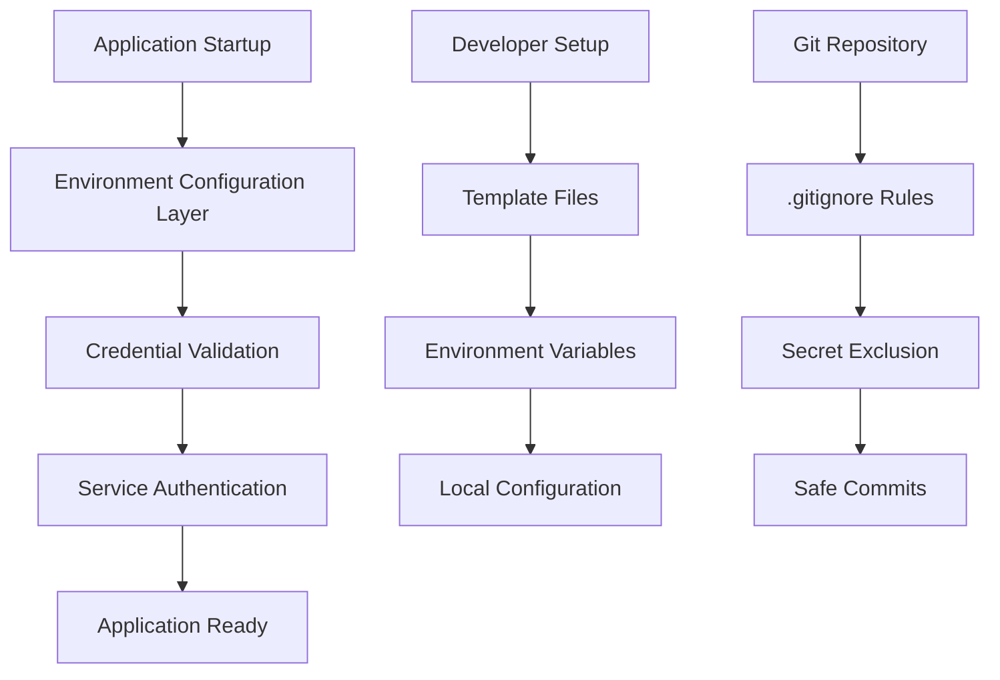

# Design Document: Secrets Management

## Overview

This design implements a comprehensive secrets management system for the Loagma CRM application. The system prevents accidental exposure of sensitive credentials while maintaining proper functionality across all environments. The solution follows security best practices by using environment variables, proper .gitignore patterns, and secure credential loading mechanisms.

## Architecture

The secrets management system consists of four main components:

1. **Environment Configuration Layer**: Loads and validates environment variables
2. **Credential Provider**: Manages Google Cloud service account authentication
3. **Security Enforcement**: Git-based protection against credential exposure
4. **Developer Tooling**: Templates and documentation for secure setup



## Components and Interfaces

### Environment Configuration Manager

**Purpose**: Centralized loading and validation of environment variables

**Interface**:
```dart
class EnvironmentConfig {
  static String? getGoogleCredentialsPath();
  static String? getGoogleCredentialsJson();
  static Map<String, String> getRequiredEnvironmentVariables();
  static void validateConfiguration();
  static void displayMissingVariables(List<String> missing);
}
```

**Key Methods**:
- `getGoogleCredentialsPath()`: Returns path to service account file from `GOOGLE_APPLICATION_CREDENTIALS`
- `getGoogleCredentialsJson()`: Returns JSON credentials from `GOOGLE_SERVICE_ACCOUNT_JSON`
- `validateConfiguration()`: Ensures all required environment variables are present
- `displayMissingVariables()`: Provides helpful error messages for missing configuration

### Google Cloud Credential Provider

**Purpose**: Secure loading and management of Google Cloud service account credentials

**Interface**:
```dart
class GoogleCredentialProvider {
  static Future<ServiceAccountCredentials> loadCredentials();
  static bool validateCredentials(ServiceAccountCredentials credentials);
  static String getCredentialSource();
}
```

**Authentication Flow**:
1. Check for `GOOGLE_SERVICE_ACCOUNT_JSON` environment variable (JSON content)
2. Check for `GOOGLE_APPLICATION_CREDENTIALS` environment variable (file path)
3. Fall back to Application Default Credentials (ADC)
4. Validate credentials before use

### Security Enforcement System

**Purpose**: Prevent accidental exposure of sensitive files through version control

**Components**:
- Enhanced `.gitignore` patterns
- Pre-commit validation (future enhancement)
- Template file system for safe configuration

**Git Ignore Patterns**:
```
# Service Account Credentials
*.json
service_account*.json
*-service-account.json
google-credentials*.json

# Environment Files
.env
.env.local
.env.*.local
.env.development
.env.staging
.env.production

# Firebase Configuration
firebase-config.json
firebase-adminsdk-*.json
```

### Developer Tooling

**Purpose**: Provide clear guidance and templates for secure credential setup

**Components**:
- Environment variable templates
- Setup documentation
- Validation scripts
- Error message system

## Data Models

### Environment Variable Schema

```dart
class EnvironmentVariables {
  // Google Cloud Authentication
  static const String GOOGLE_APPLICATION_CREDENTIALS = 'GOOGLE_APPLICATION_CREDENTIALS';
  static const String GOOGLE_SERVICE_ACCOUNT_JSON = 'GOOGLE_SERVICE_ACCOUNT_JSON';
  
  // Firebase Configuration
  static const String FIREBASE_PROJECT_ID = 'FIREBASE_PROJECT_ID';
  static const String FIREBASE_API_KEY = 'FIREBASE_API_KEY';
  
  // Application Configuration
  static const String ENVIRONMENT = 'ENVIRONMENT';
  static const String DEBUG_MODE = 'DEBUG_MODE';
}
```

### Credential Configuration Model

```dart
class CredentialConfig {
  final String source; // 'environment_json', 'file_path', or 'adc'
  final String? filePath;
  final String? jsonContent;
  final bool isValid;
  final String? errorMessage;
  
  CredentialConfig({
    required this.source,
    this.filePath,
    this.jsonContent,
    required this.isValid,
    this.errorMessage,
  });
}
```

## Correctness Properties

*A property is a characteristic or behavior that should hold true across all valid executions of a system-essentially, a formal statement about what the system should do. Properties serve as the bridge between human-readable specifications and machine-verifiable correctness guarantees.*

### Property Reflection

After reviewing all properties identified in the prework, I've identified several areas where properties can be consolidated:

- Properties 2.2 and 2.4 both test error handling for missing environment variables - these can be combined
- Properties 3.3, 5.2, 5.3, and 5.4 all test error message quality - these can be consolidated into comprehensive error handling properties
- Properties 1.1 and 1.2 both test git ignore functionality - these can be combined into a single comprehensive property

### Correctness Properties

**Property 1: Git ignore comprehensive exclusion**
*For any* sensitive file (service account JSON, environment files, or credential files), when the file is created in the repository, git status should not show it as an untracked file
**Validates: Requirements 1.1, 1.2**

**Property 2: Environment variable loading**
*For any* required environment variable that is set, the application should load and use that value instead of any default or file-based configuration
**Validates: Requirements 2.1**

**Property 3: Missing environment variable error handling**
*For any* required environment variable that is not set, the application should fail startup with a specific error message indicating which variable is missing and how to set it
**Validates: Requirements 2.2, 2.4**

**Property 4: Environment variable format validation**
*For any* environment variable with an invalid format, the application should reject it with a clear error message explaining the expected format
**Validates: Requirements 2.5**

**Property 5: Multi-environment configuration support**
*For any* valid environment configuration (development, staging, production), the application should load the appropriate settings and behave according to that environment's requirements
**Validates: Requirements 2.3**

**Property 6: Credential loading flexibility**
*For any* valid credential source (environment variable JSON, file path, or ADC), the application should successfully authenticate with Google Cloud services
**Validates: Requirements 3.1, 3.2**

**Property 7: Credential validation and error reporting**
*For any* invalid or missing credential configuration, the application should provide specific error messages that distinguish between missing credentials, invalid credentials, and include actionable suggestions for resolution
**Validates: Requirements 3.3, 5.2, 5.3, 5.4, 5.5**

**Property 8: Credential privacy protection**
*For any* application output (logs, console messages, error messages), no credential values or sensitive information should be exposed in plain text
**Validates: Requirements 3.4**

**Property 9: Startup credential validation**
*For any* application startup, all required credentials should be validated before the application becomes ready to serve requests
**Validates: Requirements 5.1**

## Error Handling

The system implements comprehensive error handling across all components:

### Environment Variable Errors
- **Missing Variables**: Clear identification of which variables are missing
- **Invalid Formats**: Specific format requirements and examples
- **Permission Issues**: Guidance for file permission problems

### Credential Errors
- **Authentication Failures**: Distinguish between network issues and credential problems
- **File Access Issues**: Clear messages for file not found or permission denied
- **JSON Parsing Errors**: Specific guidance for malformed credential files

### Git Repository Errors
- **Ignored File Warnings**: Notifications when sensitive files are accidentally tracked
- **Template Missing**: Alerts when required template files are not present

### Error Message Format
All error messages follow this structure:
```
[ERROR_TYPE] Brief description of the problem

Details: Specific information about what went wrong

Solution: Step-by-step instructions to resolve the issue

Documentation: Link to relevant setup documentation
```

## Testing Strategy

The testing strategy employs both unit tests and property-based tests to ensure comprehensive coverage:

### Unit Tests
- **Specific Examples**: Test known good and bad configurations
- **Edge Cases**: Empty strings, null values, malformed JSON
- **Integration Points**: File system access, environment variable reading
- **Error Conditions**: Network failures, permission denied scenarios

### Property-Based Tests
- **Universal Properties**: Test correctness properties across all valid inputs
- **Configuration**: Minimum 100 iterations per property test
- **Randomization**: Generate various credential formats, file paths, and environment configurations
- **Tag Format**: **Feature: secrets-management, Property {number}: {property_text}**

**Testing Framework**: Use the `test` package for Dart/Flutter with custom property-based testing utilities

**Test Organization**:
- `test/unit/` - Specific example tests and edge cases
- `test/property/` - Property-based tests for universal correctness
- `test/integration/` - End-to-end credential loading and validation tests

**Property Test Examples**:
- Generate random environment variable names and values
- Create various service account JSON structures
- Test different file path formats and permissions
- Validate error message consistency across different failure modes

Each property-based test validates one of the nine correctness properties defined above, ensuring the system behaves correctly across all possible inputs and configurations.