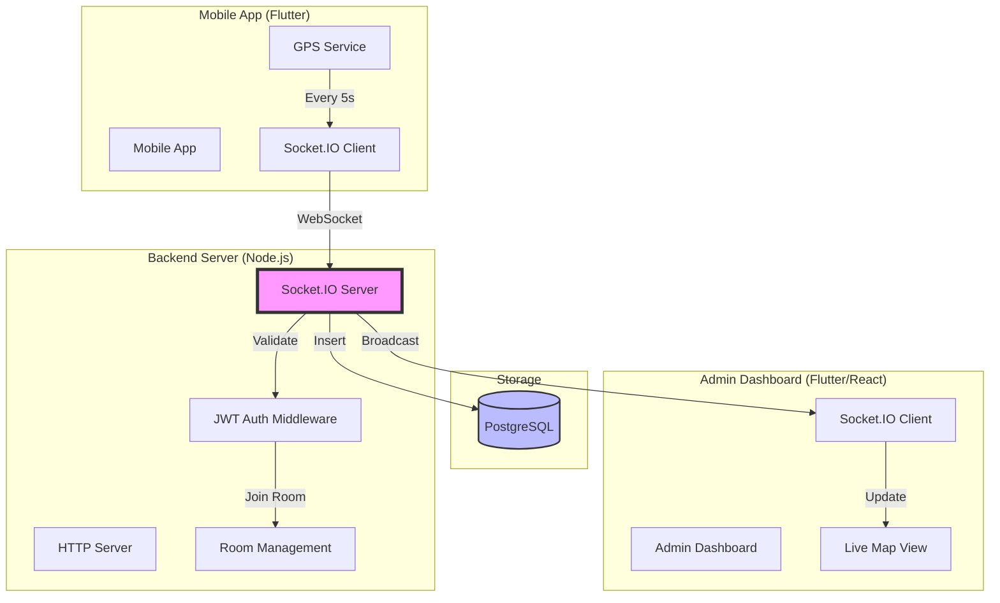
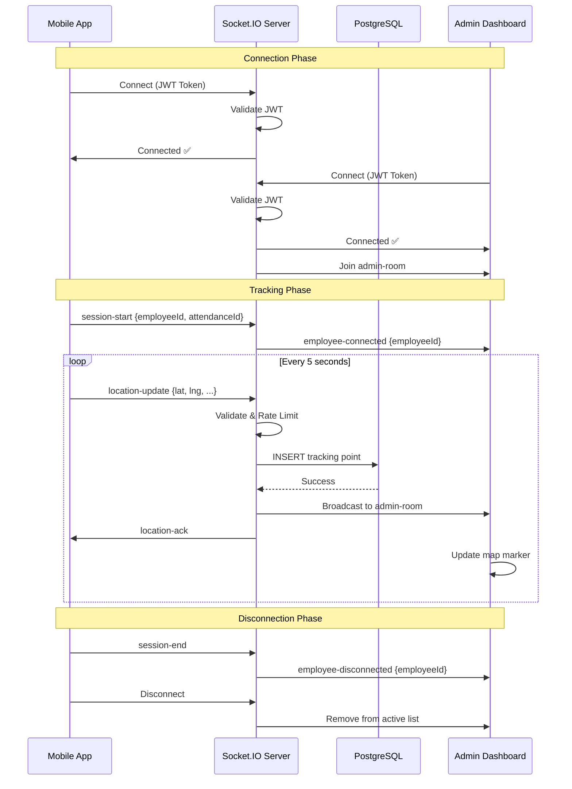

# Socket.IO Live Tracking Architecture

## System Overview



---

## Data Flow Diagram



---

## Architecture Comparison

### Before (Firestore)

```
┌─────────────────────────────────────────────────────────┐
│                    MOBILE APP                           │
│                                                         │
│  Every 5 seconds:                                       │
│  ├─→ Firestore Write (tracking_live/{employeeId})      │
│  └─→ PostgreSQL Write (via Backend API)                │
└─────────────────────────────────────────────────────────┘
                         ↓
┌─────────────────────────────────────────────────────────┐
│                   FIRESTORE                             │
│  • Real-time snapshots                                  │
│  • Automatic sync                                       │
│  • Offline support                                      │
│  • Cost: ~$10/month                                     │
└─────────────────────────────────────────────────────────┘
                         ↓
┌─────────────────────────────────────────────────────────┐
│                ADMIN DASHBOARD                          │
│  StreamBuilder → Firestore.snapshots()                  │
│  • Automatic UI updates                                 │
│  • Multiple admins supported                            │
└─────────────────────────────────────────────────────────┘
```

### After (Socket.IO)

```
┌─────────────────────────────────────────────────────────┐
│                    MOBILE APP                           │
│                                                         │
│  Every 5 seconds:                                       │
│  └─→ Socket.emit('location-update', payload)            │
└─────────────────────────────────────────────────────────┘
                         ↓
┌─────────────────────────────────────────────────────────┐
│              SOCKET.IO SERVER (Node.js)                 │
│  • JWT Authentication                                   │
│  • Room-based broadcasting                              │
│  • Rate limiting (5s interval)                          │
│  • Movement threshold (10m)                             │
│  • PostgreSQL insert                                    │
│  • Cost: Server hosting only                            │
└─────────────────────────────────────────────────────────┘
                         ↓
┌─────────────────────────────────────────────────────────┐
│                ADMIN DASHBOARD                          │
│  socket.on('location-update', callback)                 │
│  • Real-time updates                                    │
│  • In-memory state management                           │
│  • Multiple admins supported                            │
└─────────────────────────────────────────────────────────┘
```

---

## Component Details

### 1. Mobile App (Flutter)

**File**: `loagma_crm/lib/services/socket_tracking_service.dart`

**Features**:
- WebSocket-only transport (no polling)
- Automatic reconnection with exponential backoff
- Rate limiting (5-second intervals)
- Movement threshold (10 meters)
- Battery optimization
- Background tracking support

**Key Methods**:
```dart
// Connect to server
await SocketTrackingService.instance.connect();

// Start tracking
await SocketTrackingService.instance.startTracking(
  employeeId: '00028',
  attendanceId: 'clx123...',
  employeeName: 'John Doe',
);

// Stop tracking
await SocketTrackingService.instance.stopTracking();

// Disconnect
await SocketTrackingService.instance.disconnect();
```

---

### 2. Backend Server (Node.js)

**File**: `backend/src/socket/socketServer.js`

**Features**:
- JWT authentication middleware
- Room-based broadcasting (admin-room)
- Rate limiting (max 1 update per 5 seconds)
- Movement threshold validation (10 meters)
- PostgreSQL persistence
- Connection monitoring
- Automatic cleanup on disconnect

**Socket Events**:

**From Mobile**:
- `location-update` - GPS coordinates
- `session-start` - Tracking session started
- `session-end` - Tracking session ended
- `heartbeat` - Keep-alive ping

**To Mobile**:
- `location-ack` - Acknowledgment
- `error` - Error messages

**To Admin**:
- `location-update` - Broadcast GPS updates
- `employee-connected` - Employee came online
- `employee-disconnected` - Employee went offline
- `active-employees` - List of active employees

---

### 3. Admin Dashboard (Flutter)

**File**: `loagma_crm/lib/screens/admin/socket_live_tracking_screen.dart`

**Features**:
- Real-time map updates
- In-memory employee state
- Connection status indicator
- Auto-reconnection
- Multiple admin support

**Socket Events**:

**Listening**:
- `location-update` - Real-time GPS updates
- `employee-connected` - New employee online
- `employee-disconnected` - Employee offline
- `active-employees` - Initial employee list

---

## Performance Optimizations

### 1. Rate Limiting

**Mobile Side**:
```dart
// Enforce 5-second minimum interval
if (_lastSentTime != null &&
    now.difference(_lastSentTime!) < Duration(seconds: 5)) {
  return; // Skip update
}
```

**Server Side**:
```javascript
// Validate update frequency
const connectionInfo = activeConnections.get(employeeId);
if (connectionInfo?.lastUpdate && (now - connectionInfo.lastUpdate) < 5000) {
  return; // Ignore too frequent updates
}
```

### 2. Movement Threshold

**Mobile Side**:
```dart
// Only send if moved > 10 meters
final distance = Geolocator.distanceBetween(
  _lastPosition!.latitude,
  _lastPosition!.longitude,
  position.latitude,
  position.longitude,
);

if (distance < 10) {
  return; // Skip update
}
```

**Server Side**:
```javascript
// Validate movement threshold
const lastLocation = await getLastLocation(employeeId);
if (lastLocation && !hasMovedSignificantly(lastLocation, newLocation)) {
  return; // Skip if < 10 meters
}
```

### 3. Payload Compression

**Minimal Payload**:
```javascript
{
  employeeId: '00028',
  latitude: 23.123456,
  longitude: 72.654321,
  speed: 2.5,
  accuracy: 15.0,
  timestamp: '2026-02-20T10:30:45.123Z'
}
```

**Size**: ~150 bytes (vs Firestore document ~500 bytes)

### 4. Room-Based Broadcasting

```javascript
// Efficient: Only send to admins
io.to('admin-room').emit('location-update', payload);

// Inefficient: Broadcast to everyone
io.emit('location-update', payload); // ❌ Don't do this
```

---

## Scalability

### Single Server (Current)

```
┌─────────────────────────────────────────┐
│         Node.js Server                  │
│  • Socket.IO                            │
│  • In-memory connections                │
│  • Handles 50-100 concurrent users      │
└─────────────────────────────────────────┘
```

**Capacity**: 50-100 concurrent connections

### Multi-Server (Future - Redis Adapter)

```
┌──────────────┐    ┌──────────────┐    ┌──────────────┐
│  Server 1    │    │  Server 2    │    │  Server 3    │
│  Socket.IO   │    │  Socket.IO   │    │  Socket.IO   │
└──────┬───────┘    └──────┬───────┘    └──────┬───────┘
       │                   │                   │
       └───────────────────┼───────────────────┘
                           │
                    ┌──────▼───────┐
                    │    Redis     │
                    │   Adapter    │
                    └──────────────┘
```

**Implementation** (when needed):
```javascript
import { createAdapter } from '@socket.io/redis-adapter';
import { createClient } from 'redis';

const pubClient = createClient({ url: 'redis://localhost:6379' });
const subClient = pubClient.duplicate();

await Promise.all([pubClient.connect(), subClient.connect()]);

io.adapter(createAdapter(pubClient, subClient));
```

**Capacity**: 1000+ concurrent connections

---

## Security

### 1. JWT Authentication

```javascript
// Middleware validates token on connection
io.use(async (socket, next) => {
  const token = socket.handshake.auth.token;
  const decoded = jwt.verify(token, process.env.JWT_SECRET);
  socket.userId = decoded.userId;
  socket.userRole = decoded.role;
  next();
});
```

### 2. Rate Limiting

```javascript
// Max 1 update per 5 seconds per employee
if (connectionInfo?.lastUpdate && (now - connectionInfo.lastUpdate) < 5000) {
  return; // Reject
}
```

### 3. Input Validation

```javascript
// Validate coordinates
if (latitude < -90 || latitude > 90 || longitude < -180 || longitude > 180) {
  socket.emit('error', { message: 'Invalid coordinates' });
  return;
}
```

### 4. Room Isolation

```javascript
// Admins only receive updates (not other salesmen)
io.to('admin-room').emit('location-update', payload);
```

---

## Cost Comparison

### Firestore (Before)

**Writes**: 17,280 per day per employee (1 every 5 seconds)
**Reads**: ~400 per minute (10 admins watching)

**Monthly Cost** (10 employees):
- Writes: 5.2M × $0.18/million = $0.94
- Reads: 12M × $0.06/million = $0.72
- Storage: Negligible
- **Total**: ~$2-5/month

### Socket.IO (After)

**Server**: $5-10/month (DigitalOcean/AWS)
**Database**: Included (PostgreSQL already used)
**Bandwidth**: ~1GB/month (negligible)

**Monthly Cost**:
- Server hosting: $5-10
- **Total**: ~$5-10/month

**Savings**: Minimal, but better control and scalability

---

## Migration Checklist

### Backend

- [ ] Install Socket.IO: `npm install socket.io`
- [ ] Create `socketServer.js`
- [ ] Update `server.js` to use HTTP server
- [ ] Add JWT authentication middleware
- [ ] Test connection with Postman/Socket.IO client
- [ ] Deploy to production

### Mobile App

- [ ] Add dependency: `socket_io_client: ^2.0.3+1`
- [ ] Create `socket_tracking_service.dart`
- [ ] Update attendance session manager
- [ ] Remove Firestore tracking writes
- [ ] Test reconnection logic
- [ ] Test background tracking

### Admin Dashboard

- [ ] Create `socket_live_tracking_screen.dart`
- [ ] Remove Firestore StreamBuilder
- [ ] Implement in-memory state management
- [ ] Test with multiple admins
- [ ] Add connection status indicator

### Testing

- [ ] Test with 1 salesman
- [ ] Test with 10 salesmen
- [ ] Test with 5 admins watching
- [ ] Test reconnection (airplane mode)
- [ ] Test battery usage (24-hour test)
- [ ] Load test (50+ concurrent users)

---

## Monitoring

### Health Check Endpoint

```bash
GET /health

Response:
{
  "status": "ok",
  "timestamp": "2026-02-20T10:30:45.123Z",
  "connections": {
    "salesmen": 12,
    "admins": 3,
    "total": 15
  }
}
```

### Socket Status Endpoint

```bash
GET /socket/status

Response:
{
  "socketIO": "active",
  "connections": {
    "salesmen": 12,
    "admins": 3,
    "total": 15
  }
}
```

### Logging

```javascript
console.log(`📍 Location updated: ${employeeId} (${latitude}, ${longitude})`);
console.log(`🔌 Client connected: ${socket.id} (User: ${userId})`);
console.log(`🔌 Client disconnected: ${socket.id} - Reason: ${reason}`);
```

---

## Troubleshooting

### Issue: Connection Fails

**Check**:
1. JWT token is valid
2. Server is running
3. WebSocket port is open (usually same as HTTP)
4. CORS is configured correctly

### Issue: Updates Not Received

**Check**:
1. Socket is connected (`socket.connected`)
2. Employee is in tracking mode
3. Admin is in admin-room
4. Rate limiting not blocking updates

### Issue: High Battery Usage

**Check**:
1. GPS accuracy settings (use `balanced` not `high`)
2. Update interval (should be 5 seconds)
3. Movement threshold (should be 10 meters)
4. Background mode optimization

---

## Summary

### ✅ Advantages of Socket.IO

1. **Full Control**: Own your infrastructure
2. **Scalability**: Can scale to 1000+ users with Redis
3. **Cost Predictable**: Fixed server cost
4. **No Vendor Lock-in**: Can switch providers easily
5. **Custom Logic**: Implement any business rules
6. **Real-time**: True WebSocket, no polling

### ⚠️ Considerations

1. **Server Maintenance**: Need to manage server uptime
2. **Scaling Complexity**: Need Redis for multi-server
3. **No Offline Support**: Unlike Firestore's built-in offline
4. **More Code**: More implementation than Firestore

### 🎯 Recommendation

**Use Socket.IO if**:
- You need full control
- You're scaling beyond 50 users
- You want predictable costs
- You have DevOps resources

**Stick with Firestore if**:
- You want zero maintenance
- You need offline support
- You have < 20 users
- You prefer managed services

---

*Architecture designed for production-ready live tracking with Socket.IO*
