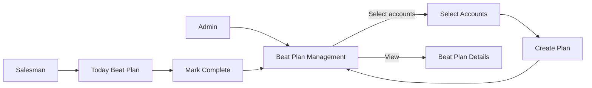
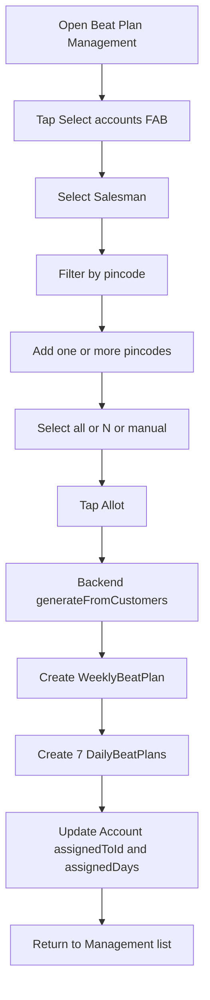
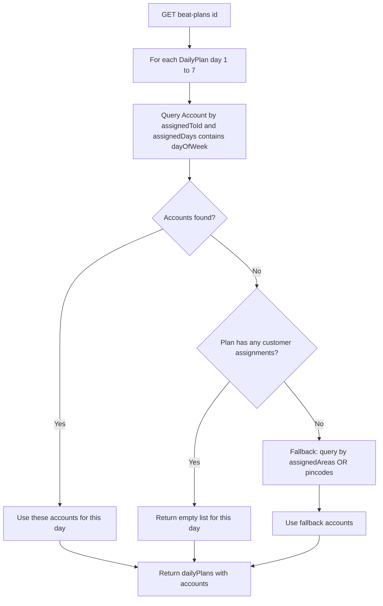
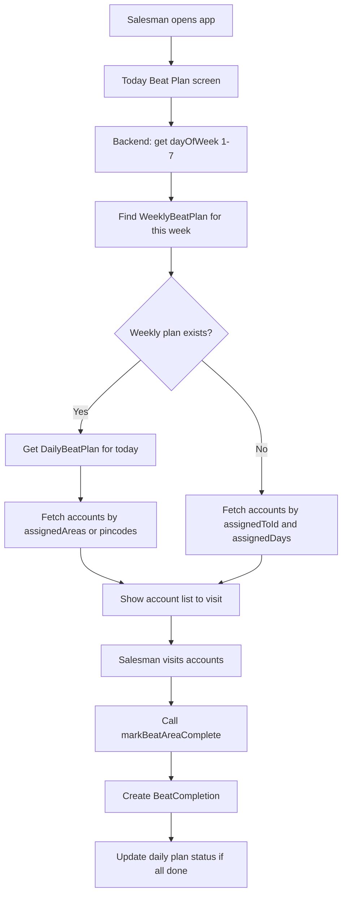
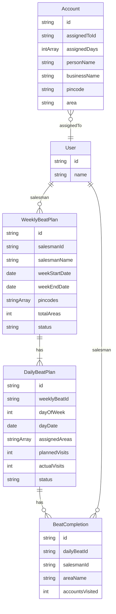

# How Weekly Beat Plans Work (Non‑Technical Guide)

---

## 1. Concepts

- **Account**: Customer record (name, business, contact, pincode, area).
- **Weekly Beat Plan**:
  - One **salesman**.
  - One **week** (Mon–Sun).
  - **Total Accounts**: total customers allotted that week.
  - **Pincodes**: pincodes covered by this plan.
- **Daily Plan (Mon–Sun)**:
  - For each day: a list of **accounts** assigned to that day.
  - **Status**: `PLANNED`, `IN_PROGRESS`, `COMPLETED`, `MISSED`.

### High-level flow

---

## 2. Admin Flow – Creating a Beat Plan

### 2.1 Entry point

- Admin opens **Beat Plan Management**.
- Clicks **"Select accounts"** (FAB) to start a new beat plan.

### 2.2 Select Salesman and Accounts

1. **Select Salesman**
   - Choose the salesman for whom the plan is being created.

2. **Select Accounts (Customer-based)**
   - Filter by **pincode** (single or multiple, chips).
   - For each pincode:
     - **Select all accounts** in that pincode, or
     - Enter **N** to select first N accounts, or
     - Manually tick individual accounts.
   - Global selection is tracked as a set of account IDs across all pincodes.
   - The **Allot / Next** button shows the **total selected accounts**.

3. **Confirm Selection**
   - When done selecting, proceed to beat plan creation.
   - Backend receives:
     - `salesmanId`
     - `weekStartDate`
     - `selectedAccountIds[]`

### 2.3 Distribute Accounts by Day (Auto / Manual)

1. **Auto distribution (current behavior)**
   - Backend splits the selected account IDs across **7 days** (Mon–Sun).
   - For each day:
     - Builds `dayAssignments[day] = [accountIds...]`.

2. **Generate Weekly Plan**

Backend (`BeatPlanService.generateFromCustomers`):

- Creates a **WeeklyBeatPlan**:
  - `salesmanId`, `salesmanName`
  - `weekStartDate`, `weekEndDate` (Mon–Sun)
  - `pincodes` (unique pincodes from assigned accounts)
  - `totalAreas` = total **accounts** (semantic = accounts, not areas)
  - `status = ACTIVE`
- For each day `1..7`:
  - Creates **DailyBeatPlan**:
    - `dayOfWeek` (1=Mon…7=Sun)
    - `dayDate`
    - `assignedAreas` (derived from account areas – legacy support)
    - `plannedVisits` = number of accounts for that day
    - `status = PLANNED`
- Updates each **Account**:
  - `assignedToId = salesmanId`
  - `assignedDays = [dayOfWeek]` for the day it is allotted.

Result: a weekly plan with 7 days, each day having N accounts.

### Admin creation flow (detailed)

---

## 3. Admin – Managing Beat Plans

### 3.1 Beat Plan Management Screen

- Lists **WeeklyBeatPlans** with summary card:

  - **Header**: salesman name, week range, status chip (e.g. ACTIVE).
  - **Stats row**:
    - **Accounts**: `totalAreas` (total accounts in the week).
    - **Done**: completion % (based on completions vs total accounts).
    - **Pincodes**: count of unique pincodes in the plan.
  - **Day preview row**:
    - Mon..Sun with numbers = **accounts/areas per day**.
  - Actions:
    - **View** – open **Beat Plan Details**.
    - **Delete** – remove weekly plan (and all daily plans/completions).

### 3.2 View / Edit Beat Plan Details

- **Top card**:
  - Salesman name, week range, status chip.
  - `Total Accounts` (total allotted accounts).
  - `Completion %`.
  - `Assigned Pincodes` as chips.

- **Daily Plans** section:
  - For each day (Mon–Sun):

    - **Header row**:
      - Day name + date.
      - Status chip (PLANNED, IN_PROGRESS, COMPLETED, MISSED).
    - **Count line**:
      - `Accounts: X` where `X = dailyPlan.accounts.length`.
    - **Account list** (if X > 0):
      - Flat list of accounts with:
        - Name / business name.
        - Contact number.
        - Address (area, pincode).
    - If no accounts:
      - `Accounts: 0` and no list.

- **Data source for per-day accounts**:
  - Backend `getWeeklyBeatPlanDetails`:
    - For each `dailyPlan.dayOfWeek`:
      - Primary query (customer-based):
        - `assignedToId = salesmanId`
        - `assignedDays` contains `dayOfWeek`
        - `isActive = true`
      - If such accounts exist ⇒ **use them**.
      - If none and there are **no customer assignments at all** ⇒ fallback to:
        - `area in dailyPlan.assignedAreas` OR `pincode in weeklyPlan.pincodes`.

- **Result**:
  - Counts and account lists per day **match** the distribution seen in Beat Plan Management.
  - Days with no assigned accounts show **0** and no list.

### How per-day accounts are loaded (Details)

---

## 4. Salesman Flow

### 4.1 Today's Beat Plan

- Salesman opens **Today's Beat Plan** screen.
- Backend `getTodaysBeatPlan`:

  1. Determine today's `dayOfWeek` (1–7).
  2. Find this week's **WeeklyBeatPlan** (by salesman, weekStartDate).
  3. Try to get a **DailyBeatPlan** for today.
  4. Fetch accounts:
     - For area-based plans:
       - Accounts by `assignedAreas` and/or `pincodes`.
     - For customer-based plans (no weekly plan or no daily plan):
       - Fallback: query accounts where:
         - `assignedToId = salesmanId`
         - `assignedDays` contains today's `dayOfWeek`.

- UI shows:
  - Summary of today (account count, status).
  - List/map of accounts to visit.

### 4.2 Marking Completion

- When salesman finishes visiting an area/day:
  - Calls `markBeatAreaComplete` with:
    - `dailyBeatId`, `areaName`, `accountsVisited`, location, notes.
  - Backend:
    - Creates **BeatCompletion** record.
    - Increments `actualVisits`.
    - If all areas for that day are completed:
      - Marks daily plan `status = COMPLETED`.

- Completion is reflected:
  - In **Beat Plan Management** as higher `Done %`.
  - In **Beat Plan Details**:
    - Status chip updates (e.g. PLANNED → COMPLETED).

### Salesman flow

---

## 5. Data Model Summary (simplified)

- **WeeklyBeatPlan**
  - `id`
  - `salesmanId`, `salesmanName`
  - `weekStartDate`, `weekEndDate`
  - `pincodes[]`
  - `totalAreas` (meaning: total accounts)
  - `status` (ACTIVE, LOCKED, COMPLETED, etc.)
  - `dailyPlans[]` (relation)

- **DailyBeatPlan**
  - `id`
  - `weeklyBeatId`
  - `dayOfWeek` (1–7)
  - `dayDate`
  - `assignedAreas[]` (legacy)
  - `plannedVisits` (accounts planned)
  - `actualVisits`
  - `status`
  - `beatCompletions[]` (relation)

- **Account**
  - `id`
  - `assignedToId` (salesman)
  - `assignedDays` (Int[]: days 1–7)
  - `personName`, `businessName`
  - `contactNumber`
  - `pincode`, `area`, `address`
  - `isActive`

### Entity relationship

