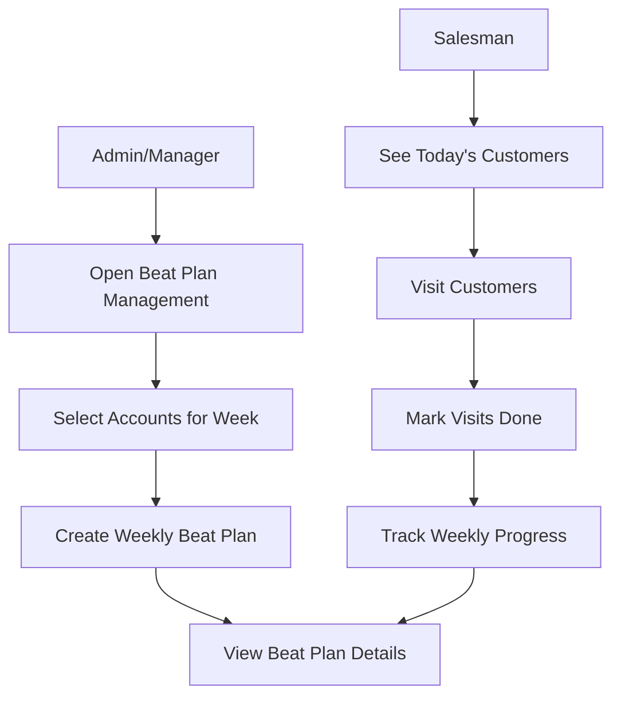

## How Weekly Beat Plans Work (For Business Users)

### 1. What is a Beat Plan?

- **Beat plan**: A weekly schedule that tells each salesman **which customers to visit on which day** (Monday to Sunday).
- **Goal**: Cover the right customers, in the right areas, with clear tracking of visits.

---

### 2. Who does what?

- **Admin / Manager**
  - Chooses the **salesman**.
  - Selects **customers (accounts)** to include in the week.
  - Confirms the weekly plan and reviews progress.

- **Salesman**
  - Sees **today’s customers** on the app.
  - Visits them and **marks visits as done**.

---

### 3. Simple workflow (step by step)

1. **Open Beat Plan Management (Admin)**
   - See list of weekly plans with:
     - Salesman name
     - Week dates
     - Total customers
     - Completion %

2. **Create / update a weekly plan**
   - Click **“Select accounts”**.
   - Choose the **salesman**.
   - Filter by **pincode(s)** and pick customers:
     - Select **all** customers in a pincode, or
     - Select **N** customers, or
     - Manually tick customers.
   - Confirm to **create the weekly plan**.
   - The system spreads these customers across the 7 days (Mon–Sun).

3. **Review details**
   - In **Beat Plan Management**, click **“View”**.
   - In **Beat Plan Details** you see:
     - Total customers for the week.
     - Assigned pincodes.
     - For each day:
       - Day name + date
       - Status (Planned / Completed / Missed)
       - `Accounts: X` → how many customers on that day
       - List of those customers (name, shop, phone, address).

4. **Daily work for the salesman**
   - Salesman opens **Today’s Beat Plan** on the app.
   - Sees **only the customers for today**.
   - Visits them and **marks visits as completed**.

5. **Track progress**
   - As visits are marked done:
     - Daily status changes from **Planned** to **Completed**.
     - Weekly **Completion %** increases.
   - Admin can always reopen **Beat Plan Management** or **Beat Plan Details** to see:
     - How many customers are planned per day.
     - How many have been visited.
     - Which days are still pending.

---

### 4. Why this helps

- Clear weekly plan for each salesman.
- Easy to see **how many customers** are assigned and **which day** they will be visited.
- Simple tracking of **what is done** and **what is pending**, without technical details.

---

### 5. Visual workflow (diagram)

